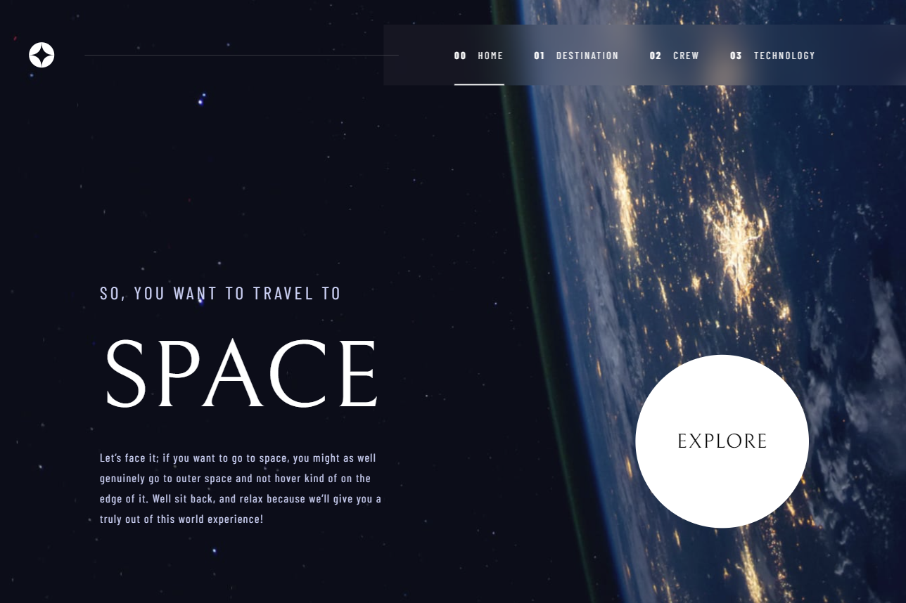

# Frontend Mentor Challenge with Frontend Queens - Space Tourism Website

This is a solution to the [Space Tourism Website challenge on Frontend Mentor with Frontend Queens](https://www.frontendmentor.io/challenges/space-tourism-multipage-website-gRWj1URZ3). Frontend Mentor challenges help you improve your coding skills by building realistic projects. 

## Table of contents

- [Overview](#overview)
  - [The challenge](#the-challenge)
  - [Screenshot](#screenshot)
  - [Links](#links)
- [My process](#my-process)
  - [Built with](#built-with)
  - [What I learned](#what-i-learned)
- [Acknowledgments](#acknowledgments)

## Overview

### The challenge

Users should be able to:

- View each page and be able to toggle between the tabs to see new information
- View the optimal layout for each of the website's pages depending on their device's screen size
- See hover states for all interactive elements on the page

### Screenshot




### Links

- Solution URL: [Solution URL](https://github.com/marinaongithub/space-tourism-website)
- Live Site URL: [Site URL](https://lighthearted-strudel-50a525.netlify.app/)

## My process

### Built with

- Semantic HTML5 markup
- CSS custom properties
- Flexbox
- Mobile-first workflow
- [React](https://reactjs.org/) - JS library

### What I learned

I discovered the <source> element which allowed me to change the image source for the "technology" page depending on the size of the screen. The  element contains the fallback image when the media width is below 1270px. The <source> element provides the source image when the available width is above or equal to 1270px. 

For more details on how to use the <source> element: [Mdn Web Docs](https://developer.mozilla.org/en-US/docs/Web/HTML/Element/source)

```html
<picture>
    {/* Image for desktop view */}
    <source media="(min-width: 1270px)" srcSet={techSelected.images.portrait} />
    {/* Image for mobile and tabletview */}
    
</picture>
```

## Acknowledgments

Thank you to Frontend Queens for organising these bi-weekly Frontend challenges and to Frontend Mentor for providing the design and starter files for this challenge.

